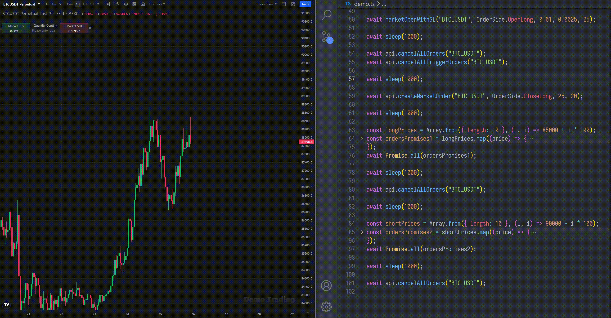

# MEXC Futures API (Bypassed)

## Overview
The **MEXC Contract API** allows you to access and manage various aspects of the MEXC Futures trading platform programmatically. The API provides access to functionalities such as managing assets, orders, positions, and account settings.

This document details all available endpoints. Those that are marked `Under maintenance` have been **bypassed**, which means they are available to use without any restrictions.

*Code is currently only available in Typescript and Python (Fully typed). Other languages available upon request.*

To get access, contact at Telegram: [@vecful](https://t.me/vecful)

---

## Endpoints Overview

### 1. **User Assets**

#### Get All Information of User's Assets
- **Endpoint**: `/private/account/assets`
  
#### Get Single Currency Asset Information
- **Endpoint**: `/private/account/asset/{currency}`

---

### 2. **Asset Transfer Records**

#### Get User's Asset Transfer Records
- **Endpoint**: `/private/account/transfer_record`

---

### 3. **User Positions**

#### Get Historical Positions
- **Endpoint**: `/private/position/list/history_positions`

#### Get Open Positions
- **Endpoint**: `/private/position/open_positions`

---

### 4. **Order Management**

#### Get Current Pending Orders
- **Endpoint**: `/private/order/list/open_orders`

#### Get Historical Orders
- **Endpoint**: `/private/order/list/history_orders`

#### Create a New Order (Bypassed under maintenance)
- **Endpoint**: `/private/order/submit`

#### Cancel Orders (Bypassed under maintenance)
- **Endpoint**: `/private/order/cancel`

#### Cancel All Orders (Bypassed under maintenance)
- **Endpoint**: `/private/order/cancel_all`

#### Cancel the order according to the external order ID (Bypassed under maintenance)
- **Endpoint**: `/private/order/cancel_with_external`

---

### 5. **Trigger Orders and Stop-Limit Orders**

#### Get Trigger Orders
- **Endpoint**: `/private/planorder/list/orders`

#### Create a Trigger Order (Bypassed under maintenance)
- **Endpoint**: `/private/planorder/place`

#### Cancel Trigger Order (Bypassed under maintenance)
- **Endpoint**: `/private/planorder/cancel`
  
#### Cancel All Trigger Orders (Bypassed under maintenance)
- **Endpoint**: `/private/planorder/cancel_all`

#### Get Stop-Limit Orders
- **Endpoint**: `/private/stoporder/list/orders`

#### Cancel single Stop-Limit trigger order (Bypassed under maintenance)
- **Endpoint**: `/private/stoporder/cancel`

#### Cancel All Stop-Limit Orders (Bypassed under maintenance)
- **Endpoint**: `/private/stoporder/cancel_all`

---

### 6. **Risk Limits and Leverage**

#### Get Risk Limits
- **Endpoint**: `/private/account/risk_limit`

#### Change Margin
- **Endpoint**: `/private/position/change_margin`

#### Get Leverage
- **Endpoint**: `/private/position/leverage`

#### Change Leverage
- **Endpoint**: `/private/position/change_leverage`

#### Get Position Mode
- **Endpoint**: `/private/position/position_mode`

#### Change Position Mode
- **Endpoint**: `/private/position/change_position_mode`

---

### 7. Extra (simplified methods)

#### Market order

#### Stop limit order
